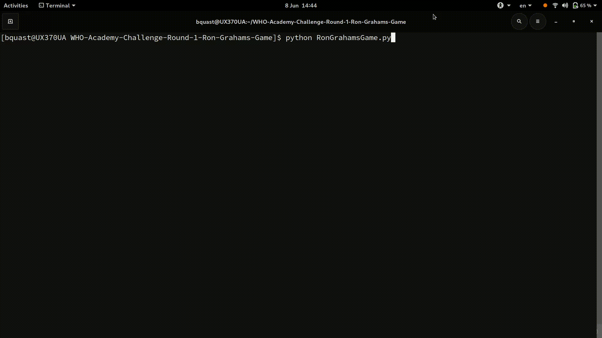

# Ron Graham's Game

Ron Graham's Game is a numerical variant of Naughts and Crosses/ Tic-Tac-Toe. In the general form, the board is a square matrix of length `L >= 3`, Player 1 has stones for all the Odd numbers in the range `1:L`, Player 2 has stones for all the Even numbers in the range `2:(L-1)`, a player wins if it completes a row/column/diagonal and the sum equals `(1:L)L/2`.

Ron Graham's Game is the variant where `L==3`, it has shown that Ron Graham's Game has an optimal strategy for the Player 1 (Odds), the variant where `L=4` has been shown to have an optimal strategy for Player 2 (Evens).

## Usage

The file [RonGrahamsGame.py](RonGrahamsGame.py) is a self contained Python 3 file including the game and the optimiser to play against, it can be executed using:

    $ python ./RonGrahamsGame.py

It will first prompt you if you wish to level up (play against the optimiser), you can chose to do so, simply by pressing `Enter` (since it is the default option).

## Troubleshooting

If you encounter the error:

      File "RonGrahamsGame.py", line 71
        print('{} '.format(move), end='')
                                 ^
    SyntaxError: invalid syntax

This is caused by executing with `Python 2` instead of `Python 3`, because your system has `Python 2` as its default.
In that case you can execute using:

    $ python3 ./RonGrahamsGame.py

## Development

[RonGrahamsGame.py](RonGrahamsGame.py) was developed with `Python 3.8.3` on a Arch Linux machine with Kernel `v.5.7.1`, it should run on any `Python 3` machine.

## License

The [LICENSE](LICENSE) is MIT.

## Attribution

The game implementation is adapted from @aroques, the optimiser is based on Peter Norvig's AIMA code.

